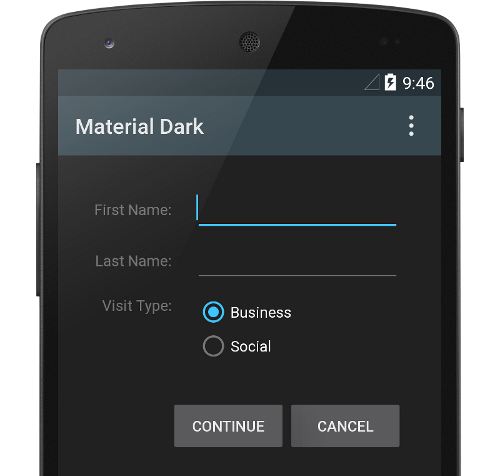

footer: mobilecoder.mx

#Android's Design Elements & Patterns
##Oscar Swanros

---

#@Swanros
#swanros.com

----

#[fit]MobileCoder.mx
##[fit]github.com/MobileCoderMx/presentations

---

#[fit]Difference Between Platforms

---

---

---

---

#2 styles

---

---

#[fit] Branding

---

---

---

---

#What's different?

#What's similar?

---

---

# You must learn to identify these differences and use them to your advantage.

---

# Companies sometimes try to design once, run everywhere.

---

#[fit] That's wrong.

---

#[fit] Embrace your ecosystem.

---

#[fit]Questions?

---

#[fit]http://www.mobile-patterns.com
