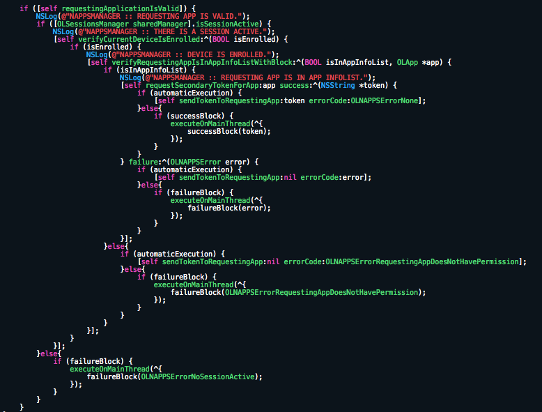
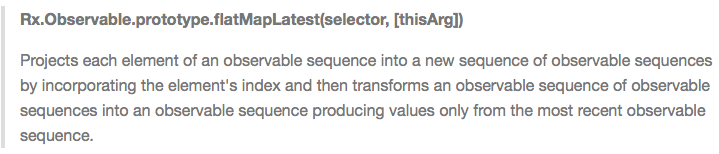

footer: mobilecoder.mx, 2015
slidenumbers: true

#[fit] Functional Reactive Programming
### Oscar Swanros
##### MobileCoder.mx

---

#@Swanros
#http://swanros.com

---

# I got bored.

---

# Until...

---

#[fit] WWDC '14

---

# I'm running away from OOP and the MVC pattern.

---

# And also a little bit of...


---

```objc
typedef (^myBlock)(BOOL isThisCool) = ^void() {
  //
};
```

---

#[fit] Callback hell, anyone?

---

#[fit]Because it gets boring quickly...

### :sleeping:

---

###[fit] Enter **FRP**.
---

# Functional Reactive Programming
# =
#[fit] Functional Programming + Reactive Programming

---

# Functional Programming
### In a *purely functional* language, `f(x)` will return the same value for the same `x`.

# **Always**.

^ Everything is about first-class functions.

---

# Reactive Programming

### In a *reactive* language, `y=f(x)`

# `y` will always stay up to date when `x` changes.

---


---

# **FRP** is about datatypes that represent a *value* over *time*.

---

#[fit] At the core of FRP are Signals.

---

#[fit] A *Signal* is a **value** that changes **over time**.

---

```go
done := make(chan bool)

watcher := notificator.New()
for {
  select {
    case newText := <-watcher.Next:
    fmt.Println(newText)

    case error := <-watcher.Error:
    log.Fatal(error)
  }
}

<-done
```

---

```objc
[self.emailTextField.rac_textSignal subscribeNext:^(id value) {
  NSLog(@"%@", value);
}];
```

---


---


```objc
@interface ViewController()<UITextFieldDelegate>

// ...

self.emailTextField.delegate = self;

// ...

-(BOOL)textField:(UITextField *)textField
       shouldChangeCharactersInRange:(NSRange)range
       replacementString:(NSString *)string {
          NSLog(@"%@", [textField.text stringByAppendingString:string]);

          return YES;
}
```

^ note how the callback only returns the portion of the string that changed

---

```objc
[self.emailTextField.rac_textSignal subscribeNext:^(id value) {
  NSLog(@"%@", value);
}];
```
---

```objc
// 1
RACSignal *usernameTextSignal = self.usernameTextField.rac_textSignal;
RACSignal *passwordTextSignal = self.passwordTextField.rac_textSignal;

// 2
RACSignal *validUsernameSignal = [[usernameTextSignal map:^id(NSString *username) {
    return @([self isValidUsername:username]);
}] distinctUntilChanged];
RACSignal *validPasswordSignal = [[passwordTextSignal map:^id(NSString *password) {
    return @([self isValidPassword:password]);
}] distinctUntilChanged];

// 3
RAC(self.usernameTextField, backgroundColor) = [validUsernameSignal map:^id(NSNumber *usernameValid) {
    return [usernameValid boolValue] ? [UIColor greenColor] : [UIColor redColor];
}];
RAC(self.passwordTextField, backgroundColor) = [validPasswordSignal map:^id(NSNumber *passwordValid) {
    return [passwordValid boolValue] ? [UIColor greenColor] : [UIColor redColor];
}];

// 4
[[RACSignal combineLatest:@[validUsernameSignal, validPasswordSignal]
                   reduce:^id(NSNumber *usernameValid, NSNumber *passwordValid){
                       return @([usernameValid boolValue] == YES && [passwordValid boolValue] == YES);
                   }] subscribeNext:^(NSNumber *loginButtonActive) {
                       self.loginButton.enabled = [loginButtonActive boolValue];
                   }];
```

---


---

#[fit] Functional Reactive Programming lets you be more concise with your code.

---

#[fit] Focus on what you *want* to do,
and not on *how* to do it.

---

### (That's the Functional *motto*.)

---

#[fit] Resources?

---

#Ruby: frapuccino

```ruby
class Button
  def push
    emit(:pushed)
  end
end

button = Button.new
stream = Frappuccino::Stream.new(button)

counter = stream
            .map {|event| event == :pushed ? 1 : 0 }
            .inject(0) {|sum, n| sum + n }

counter.now # => 0
button.push
counter.now # => 1
```

---

#JS: RxJS
```js
var source = getStockData();

source
  .filter(function (quote) {
      return quote.price > 30;
  })
  .map(function (quote) {
      return quote.price;
  })
  .forEach(function (price) {
    console.log('Prices higher than $30: $' + price);
  });
```

---

# Learning FRP is hard.



---

# But it's worth it.

---

#[fit] Questions?
